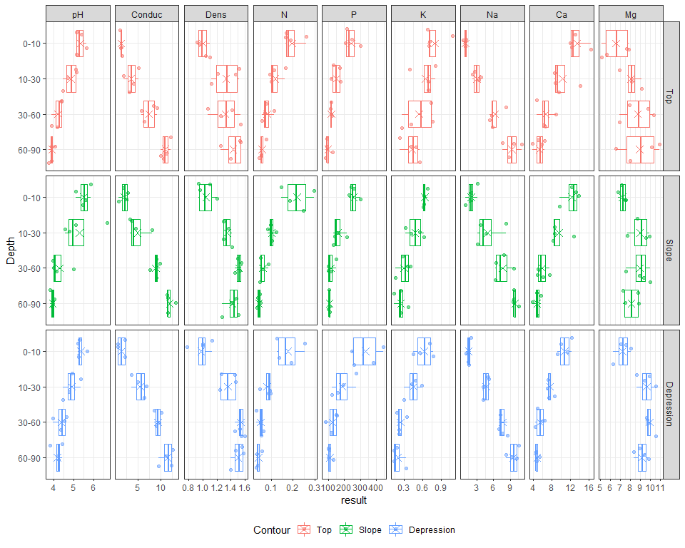
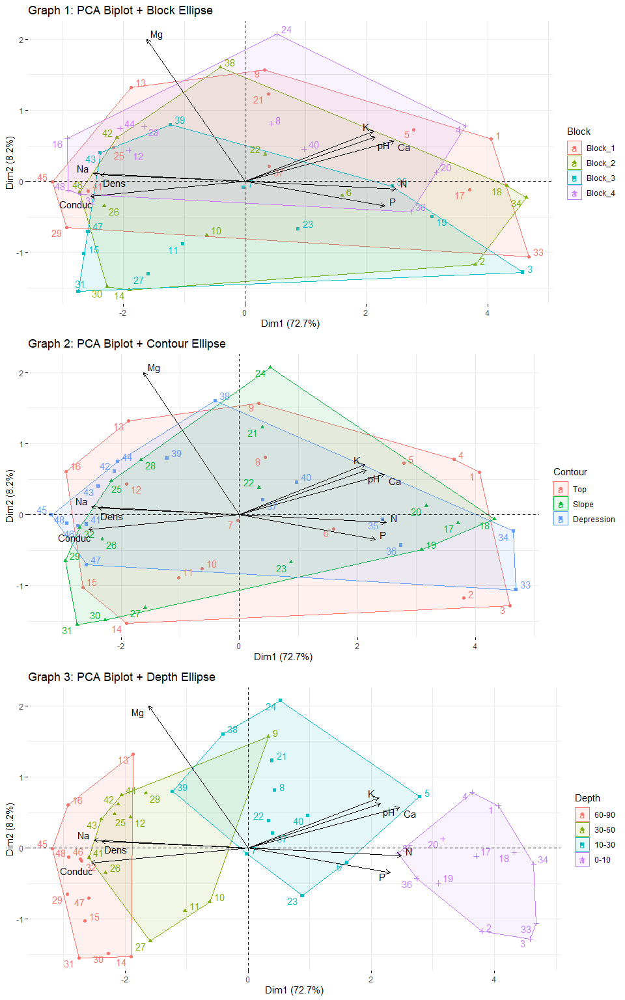

Soil Profile Statistical Analysis
================
Kar
2022-07

-   [1 R PACKAGES](#1-r-packages)
-   [2 DATA PREPARATION](#2-data-preparation)
    -   [2.1 Data Import](#21-data-import)
    -   [2.2 Data Description](#22-data-description)
    -   [2.3 Data Exploration](#23-data-exploration)
-   [3 DATA CLEANING](#3-data-cleaning)
    -   [3.1 Removing Group and Gp](#31-removing-group-and-gp)
    -   [3.2 Rearrange](#32-rearrange)
    -   [3.3 Trimming](#33-trimming)
    -   [3.4 Rearrange levels](#34-rearrange-levels)
-   [4 EXPLORATORY DATA ANALYSIS](#4-exploratory-data-analysis)
    -   [4.1 Univariate histogram](#41-univariate-histogram)
    -   [4.2 Soil Chemistries against Soil
        Depth](#42-soil-chemistries-against-soil-depth)
    -   [4.3 Soil Chemistries against
        Contour](#43-soil-chemistries-against-contour)
    -   [4.4 PCA for characterisation](#44-pca-for-characterisation)
-   [5 STATISTICAL ANALYSIS](#5-statistical-analysis)
    -   [5.1 MANOVA](#51-manova)

------------------------------------------------------------------------

------------------------------------------------------------------------

# 1 R PACKAGES

``` r
library(tidyverse)
library(car)
library(kableExtra)
library(cowplot)
library(gridExtra)
library(factoextra)
library(FactoMineR)
```

# 2 DATA PREPARATION

## 2.1 Data Import

Randomly sample 10 rows of data from the table

``` r
sample_n(Soils, 10) %>% 
  kbl() %>%
  kable_styling(bootstrap_options = c("bordered", "stripped", "hover"), full_width = F)
```

<table class="table table-bordered table-hover" style="width: auto !important; margin-left: auto; margin-right: auto;">
<thead>
<tr>
<th style="text-align:left;">
</th>
<th style="text-align:left;">

Group

</th>
<th style="text-align:left;">

Contour

</th>
<th style="text-align:left;">

Depth

</th>
<th style="text-align:left;">

Gp

</th>
<th style="text-align:left;">

Block

</th>
<th style="text-align:right;">

pH

</th>
<th style="text-align:right;">

N

</th>
<th style="text-align:right;">

Dens

</th>
<th style="text-align:right;">

P

</th>
<th style="text-align:right;">

Ca

</th>
<th style="text-align:right;">

Mg

</th>
<th style="text-align:right;">

K

</th>
<th style="text-align:right;">

Na

</th>
<th style="text-align:right;">

Conduc

</th>
</tr>
</thead>
<tbody>
<tr>
<td style="text-align:left;">

35

</td>
<td style="text-align:left;">

9

</td>
<td style="text-align:left;">

Depression

</td>
<td style="text-align:left;">

0-10

</td>
<td style="text-align:left;">

D0

</td>
<td style="text-align:left;">

3

</td>
<td style="text-align:right;">

5.30

</td>
<td style="text-align:right;">

0.136

</td>
<td style="text-align:right;">

1.00

</td>
<td style="text-align:right;">

259

</td>
<td style="text-align:right;">

9.96

</td>
<td style="text-align:right;">

8.08

</td>
<td style="text-align:right;">

0.45

</td>
<td style="text-align:right;">

1.97

</td>
<td style="text-align:right;">

2.27

</td>
</tr>
<tr>
<td style="text-align:left;">

9

</td>
<td style="text-align:left;">

3

</td>
<td style="text-align:left;">

Top

</td>
<td style="text-align:left;">

30-60

</td>
<td style="text-align:left;">

T3

</td>
<td style="text-align:left;">

1

</td>
<td style="text-align:right;">

4.37

</td>
<td style="text-align:right;">

0.112

</td>
<td style="text-align:right;">

1.07

</td>
<td style="text-align:right;">

121

</td>
<td style="text-align:right;">

8.85

</td>
<td style="text-align:right;">

10.35

</td>
<td style="text-align:right;">

0.74

</td>
<td style="text-align:right;">

5.74

</td>
<td style="text-align:right;">

5.73

</td>
</tr>
<tr>
<td style="text-align:left;">

34

</td>
<td style="text-align:left;">

9

</td>
<td style="text-align:left;">

Depression

</td>
<td style="text-align:left;">

0-10

</td>
<td style="text-align:left;">

D0

</td>
<td style="text-align:left;">

2

</td>
<td style="text-align:right;">

5.20

</td>
<td style="text-align:right;">

0.256

</td>
<td style="text-align:right;">

0.78

</td>
<td style="text-align:right;">

380

</td>
<td style="text-align:right;">

11.39

</td>
<td style="text-align:right;">

7.55

</td>
<td style="text-align:right;">

0.78

</td>
<td style="text-align:right;">

1.63

</td>
<td style="text-align:right;">

2.20

</td>
</tr>
<tr>
<td style="text-align:left;">

17

</td>
<td style="text-align:left;">

5

</td>
<td style="text-align:left;">

Slope

</td>
<td style="text-align:left;">

0-10

</td>
<td style="text-align:left;">

S0

</td>
<td style="text-align:left;">

1

</td>
<td style="text-align:right;">

5.11

</td>
<td style="text-align:right;">

0.247

</td>
<td style="text-align:right;">

0.94

</td>
<td style="text-align:right;">

261

</td>
<td style="text-align:right;">

13.25

</td>
<td style="text-align:right;">

7.55

</td>
<td style="text-align:right;">

0.61

</td>
<td style="text-align:right;">

1.86

</td>
<td style="text-align:right;">

2.61

</td>
</tr>
<tr>
<td style="text-align:left;">

41

</td>
<td style="text-align:left;">

11

</td>
<td style="text-align:left;">

Depression

</td>
<td style="text-align:left;">

30-60

</td>
<td style="text-align:left;">

D3

</td>
<td style="text-align:left;">

1

</td>
<td style="text-align:right;">

3.94

</td>
<td style="text-align:right;">

0.054

</td>
<td style="text-align:right;">

1.60

</td>
<td style="text-align:right;">

148

</td>
<td style="text-align:right;">

4.85

</td>
<td style="text-align:right;">

9.62

</td>
<td style="text-align:right;">

0.18

</td>
<td style="text-align:right;">

7.20

</td>
<td style="text-align:right;">

10.14

</td>
</tr>
<tr>
<td style="text-align:left;">

23

</td>
<td style="text-align:left;">

6

</td>
<td style="text-align:left;">

Slope

</td>
<td style="text-align:left;">

10-30

</td>
<td style="text-align:left;">

S1

</td>
<td style="text-align:left;">

3

</td>
<td style="text-align:right;">

4.78

</td>
<td style="text-align:right;">

0.122

</td>
<td style="text-align:right;">

1.30

</td>
<td style="text-align:right;">

214

</td>
<td style="text-align:right;">

8.22

</td>
<td style="text-align:right;">

7.75

</td>
<td style="text-align:right;">

0.32

</td>
<td style="text-align:right;">

3.07

</td>
<td style="text-align:right;">

3.67

</td>
</tr>
<tr>
<td style="text-align:left;">

4

</td>
<td style="text-align:left;">

1

</td>
<td style="text-align:left;">

Top

</td>
<td style="text-align:left;">

0-10

</td>
<td style="text-align:left;">

T0

</td>
<td style="text-align:left;">

4

</td>
<td style="text-align:right;">

5.14

</td>
<td style="text-align:right;">

0.169

</td>
<td style="text-align:right;">

1.10

</td>
<td style="text-align:right;">

248

</td>
<td style="text-align:right;">

11.92

</td>
<td style="text-align:right;">

7.88

</td>
<td style="text-align:right;">

1.09

</td>
<td style="text-align:right;">

1.01

</td>
<td style="text-align:right;">

1.64

</td>
</tr>
<tr>
<td style="text-align:left;">

19

</td>
<td style="text-align:left;">

5

</td>
<td style="text-align:left;">

Slope

</td>
<td style="text-align:left;">

0-10

</td>
<td style="text-align:left;">

S0

</td>
<td style="text-align:left;">

3

</td>
<td style="text-align:right;">

5.61

</td>
<td style="text-align:right;">

0.145

</td>
<td style="text-align:right;">

1.10

</td>
<td style="text-align:right;">

242

</td>
<td style="text-align:right;">

9.66

</td>
<td style="text-align:right;">

6.76

</td>
<td style="text-align:right;">

0.63

</td>
<td style="text-align:right;">

1.01

</td>
<td style="text-align:right;">

0.76

</td>
</tr>
<tr>
<td style="text-align:left;">

21

</td>
<td style="text-align:left;">

6

</td>
<td style="text-align:left;">

Slope

</td>
<td style="text-align:left;">

10-30

</td>
<td style="text-align:left;">

S1

</td>
<td style="text-align:left;">

1

</td>
<td style="text-align:right;">

4.57

</td>
<td style="text-align:right;">

0.102

</td>
<td style="text-align:right;">

1.37

</td>
<td style="text-align:right;">

156

</td>
<td style="text-align:right;">

8.58

</td>
<td style="text-align:right;">

9.92

</td>
<td style="text-align:right;">

0.63

</td>
<td style="text-align:right;">

3.67

</td>
<td style="text-align:right;">

3.24

</td>
</tr>
<tr>
<td style="text-align:left;">

6

</td>
<td style="text-align:left;">

2

</td>
<td style="text-align:left;">

Top

</td>
<td style="text-align:left;">

10-30

</td>
<td style="text-align:left;">

T1

</td>
<td style="text-align:left;">

2

</td>
<td style="text-align:right;">

5.10

</td>
<td style="text-align:right;">

0.094

</td>
<td style="text-align:right;">

1.22

</td>
<td style="text-align:right;">

129

</td>
<td style="text-align:right;">

8.55

</td>
<td style="text-align:right;">

6.92

</td>
<td style="text-align:right;">

0.81

</td>
<td style="text-align:right;">

2.67

</td>
<td style="text-align:right;">

3.18

</td>
</tr>
</tbody>
</table>

## 2.2 Data Description

``` r
Variables <- names(Soils)

Description <- c("a factor with 12 levels, corresponding to the combinations of Contour and Depth",
                 "a factor with 3 levels: Depression Slope Top",
                 "a factor with 4 levels: 0-10 10-30 30-60 60-90",
                 "a factor with 12 levels, giving abbreviations for the groups: D0 D1 D3 D6 S0 S1 S3 S6 T0 T1 T3 T6",
                 "a factor with levels 1 2 3 4",
                 "soil pH",
                 "total nitrogen in %",
                 "bulk density in gm/cm$^3$",
                 "total phosphorous in ppm",
                 "calcium in me/100 gm.",
                 "magnesium in me/100 gm.",
                 "phosphorous in me/100 gm.",
                 "sodium in me/100 gm.",
                 "conductivity Details")

data.frame(Variables, Description) %>% 
  kbl() %>%
  kable_styling(bootstrap_options = c("bordered", "stripped", "hover"), full_width = F)
```

<table class="table table-bordered table-hover" style="width: auto !important; margin-left: auto; margin-right: auto;">
<thead>
<tr>
<th style="text-align:left;">

Variables

</th>
<th style="text-align:left;">

Description

</th>
</tr>
</thead>
<tbody>
<tr>
<td style="text-align:left;">

Group

</td>
<td style="text-align:left;">

a factor with 12 levels, corresponding to the combinations of Contour
and Depth

</td>
</tr>
<tr>
<td style="text-align:left;">

Contour

</td>
<td style="text-align:left;">

a factor with 3 levels: Depression Slope Top

</td>
</tr>
<tr>
<td style="text-align:left;">

Depth

</td>
<td style="text-align:left;">

a factor with 4 levels: 0-10 10-30 30-60 60-90

</td>
</tr>
<tr>
<td style="text-align:left;">

Gp

</td>
<td style="text-align:left;">

a factor with 12 levels, giving abbreviations for the groups: D0 D1 D3
D6 S0 S1 S3 S6 T0 T1 T3 T6

</td>
</tr>
<tr>
<td style="text-align:left;">

Block

</td>
<td style="text-align:left;">

a factor with levels 1 2 3 4

</td>
</tr>
<tr>
<td style="text-align:left;">

pH

</td>
<td style="text-align:left;">

soil pH

</td>
</tr>
<tr>
<td style="text-align:left;">

N

</td>
<td style="text-align:left;">

total nitrogen in %

</td>
</tr>
<tr>
<td style="text-align:left;">

Dens

</td>
<td style="text-align:left;">

bulk density in
gm/cm

</td>
</tr>
<tr>
<td style="text-align:left;">

P

</td>
<td style="text-align:left;">

total phosphorous in ppm

</td>
</tr>
<tr>
<td style="text-align:left;">

Ca

</td>
<td style="text-align:left;">

calcium in me/100 gm.

</td>
</tr>
<tr>
<td style="text-align:left;">

Mg

</td>
<td style="text-align:left;">

magnesium in me/100 gm.

</td>
</tr>
<tr>
<td style="text-align:left;">

K

</td>
<td style="text-align:left;">

phosphorous in me/100 gm.

</td>
</tr>
<tr>
<td style="text-align:left;">

Na

</td>
<td style="text-align:left;">

sodium in me/100 gm.

</td>
</tr>
<tr>
<td style="text-align:left;">

Conduc

</td>
<td style="text-align:left;">

conductivity Details

</td>
</tr>
</tbody>
</table>

## 2.3 Data Exploration

-   This is a small data set with 48 rows of data and 14 variables.
-   There are 4 factor variables which are “Group”, “Contour”, “Depth”,
    “Gp”, and “Block”.  
-   There are 9 numerical variables which are “pH”, “N”, “Dens”, “P”,
    “Ca”, “Mg”, “K”, “Na”, and “Conduc”.

``` r
glimpse(Soils)
```

    ## Rows: 48
    ## Columns: 14
    ## $ Group   <fct> 1, 1, 1, 1, 2, 2, 2, 2, 3, 3, 3, 3, 4, 4, 4, 4, 5, 5, 5, 5, 6,…
    ## $ Contour <fct> Top, Top, Top, Top, Top, Top, Top, Top, Top, Top, Top, Top, To…
    ## $ Depth   <fct> 0-10, 0-10, 0-10, 0-10, 10-30, 10-30, 10-30, 10-30, 30-60, 30-…
    ## $ Gp      <fct> T0, T0, T0, T0, T1, T1, T1, T1, T3, T3, T3, T3, T6, T6, T6, T6…
    ## $ Block   <fct> 1, 2, 3, 4, 1, 2, 3, 4, 1, 2, 3, 4, 1, 2, 3, 4, 1, 2, 3, 4, 1,…
    ## $ pH      <dbl> 5.40, 5.65, 5.14, 5.14, 5.14, 5.10, 4.70, 4.46, 4.37, 4.39, 4.…
    ## $ N       <dbl> 0.188, 0.165, 0.260, 0.169, 0.164, 0.094, 0.100, 0.112, 0.112,…
    ## $ Dens    <dbl> 0.92, 1.04, 0.95, 1.10, 1.12, 1.22, 1.52, 1.47, 1.07, 1.54, 1.…
    ## $ P       <int> 215, 208, 300, 248, 174, 129, 117, 170, 121, 115, 112, 117, 12…
    ## $ Ca      <dbl> 16.35, 12.25, 13.02, 11.92, 14.17, 8.55, 8.74, 9.49, 8.85, 4.7…
    ## $ Mg      <dbl> 7.65, 5.15, 5.68, 7.88, 8.12, 6.92, 8.16, 9.16, 10.35, 6.91, 7…
    ## $ K       <dbl> 0.72, 0.71, 0.68, 1.09, 0.70, 0.81, 0.39, 0.70, 0.74, 0.77, 0.…
    ## $ Na      <dbl> 1.14, 0.94, 0.60, 1.01, 2.17, 2.67, 3.32, 3.76, 5.74, 5.85, 5.…
    ## $ Conduc  <dbl> 1.09, 1.35, 1.41, 1.64, 1.85, 3.18, 4.16, 5.14, 5.73, 6.45, 8.…

There is no missing value in the data set.

``` r
colSums(is.na(Soils))
```

    ##   Group Contour   Depth      Gp   Block      pH       N    Dens       P      Ca 
    ##       0       0       0       0       0       0       0       0       0       0 
    ##      Mg       K      Na  Conduc 
    ##       0       0       0       0

Summarising the data:

``` r
summary(Soils, maxsum = 12)
```

    ##  Group        Contour     Depth     Gp    Block        pH       
    ##  1 :4   Depression:16   0-10 :12   D0:4   1:12   Min.   :3.740  
    ##  2 :4   Slope     :16   10-30:12   D1:4   2:12   1st Qu.:4.058  
    ##  3 :4   Top       :16   30-60:12   D3:4   3:12   Median :4.545  
    ##  4 :4                   60-90:12   D6:4   4:12   Mean   :4.669  
    ##  5 :4                              S0:4          3rd Qu.:5.140  
    ##  6 :4                              S1:4          Max.   :6.670  
    ##  7 :4                              S3:4                         
    ##  8 :4                              S6:4                         
    ##  9 :4                              T0:4                         
    ##  10:4                              T1:4                         
    ##  11:4                              T3:4                         
    ##  12:4                              T6:4                         
    ##        N                Dens             P               Ca        
    ##  Min.   :0.03000   Min.   :0.780   Min.   : 79.0   Min.   : 3.820  
    ##  1st Qu.:0.05075   1st Qu.:1.127   1st Qu.:108.8   1st Qu.: 5.040  
    ##  Median :0.08450   Median :1.400   Median :131.0   Median : 7.305  
    ##  Mean   :0.10194   Mean   :1.316   Mean   :166.2   Mean   : 8.029  
    ##  3rd Qu.:0.12925   3rd Qu.:1.502   3rd Qu.:214.2   3rd Qu.: 9.735  
    ##  Max.   :0.29800   Max.   :1.600   Max.   :445.0   Max.   :16.350  
    ##                                                                    
    ##                                                                    
    ##                                                                    
    ##                                                                    
    ##                                                                    
    ##                                                                    
    ##        Mg               K                Na             Conduc      
    ##  Min.   : 5.150   Min.   :0.1400   Min.   : 0.600   Min.   : 0.670  
    ##  1st Qu.: 7.537   1st Qu.:0.2750   1st Qu.: 2.545   1st Qu.: 2.790  
    ##  Median : 8.515   Median :0.4250   Median : 5.520   Median : 6.635  
    ##  Mean   : 8.465   Mean   :0.4662   Mean   : 5.600   Mean   : 6.589  
    ##  3rd Qu.: 9.648   3rd Qu.:0.6425   3rd Qu.: 8.355   3rd Qu.: 9.852  
    ##  Max.   :10.960   Max.   :1.0900   Max.   :11.040   Max.   :13.320  
    ##                                                                     
    ##                                                                     
    ##                                                                     
    ##                                                                     
    ##                                                                     
    ## 

Based on the information in the variables “contour”, “depth”, and
“block.” I can see that the data are actually collected from 4 different
block (1 to 4), and there are 3 different Contour in each block, which
are “top”, “slope” and “depression”.

In each Contour of each block, soils are collected in 4 different soil
depth as described below.


# 3 DATA CLEANING

## 3.1 Removing Group and Gp

Group and Gp are duplicates of each other, however, I will remove them
because they are not the best representation (though not bad) of the
information, from my experience as an environmental consultant
specialised in soil science. I will create an alternative of them if
required.

``` r
Soils <- Soils %>% dplyr::select(-Group, -Gp)
```

## 3.2 Rearrange

This step is optional. I am relocating “Block” to be the first column

``` r
Soils <- Soils %>% relocate(Block, .before = Contour)
```

## 3.3 Trimming

Remove leading and/or trailing white space from character strings.

``` r
Soils <- Soils %>% 
  mutate(Block = as.factor(trimws(Block)),
         Contour = as.factor(trimws(Contour)),
         Depth = as.factor(trimws(Depth)))  
```

## 3.4 Rearrange levels

Rearrange the sequence of levels in the factor variable “Contour” and
“Depth”, so that they are in the right orders during visualisation.

Current sequence of categories (technically known as “levels”) in the
variable “Contour”:

``` r
levels(Soils$Contour)
```

    ## [1] "Depression" "Slope"      "Top"

Current sequence of categories (technically known as “levels”) in the
variable “Depth”:

``` r
levels(Soils$Depth)
```

    ## [1] "0-10"  "10-30" "30-60" "60-90"

I will be reversing the order of these categories in “Contour” and
“Depth”.

Operation:

``` r
Soils <- Soils %>%
  mutate(Contour = fct_relevel(Contour, "Top", "Slope", "Depression"),
         Depth = fct_relevel(Depth, "60-90", "30-60", "10-30", "0-10"))
```

# 4 EXPLORATORY DATA ANALYSIS

``` r
soil.df <- Soils  %>% 
  pivot_longer(c(4:12), names_to = "chemistry", values_to = "result") %>% 
  mutate(chemistry = as.factor(chemistry),
         chemistry = fct_relevel(chemistry, "pH", "Conduc", "Dens", "N", "P", "K", "Na", "Ca", "Mg")) 
```

## 4.1 Univariate histogram

Following shows the graphs for each variables in the data set.

``` r
g1 <- soil.df %>% group_by(Block) %>% summarise(count = n()) %>% 
  ggplot(aes(x = Block, y = count)) + geom_bar(stat = "identity") + geom_label(aes(label = count)) +
  ggtitle("Sample sizes of Block Categories")

g2 <- soil.df %>% group_by(Contour) %>% summarise(count = n()) %>% 
  ggplot(aes(x = Contour, y = count)) + geom_bar(stat = "identity") + geom_label(aes(label = count)) +
  ggtitle("Sample sizes of Contour Categories")

g3 <- soil.df %>% group_by(Depth) %>% summarise(count = n()) %>% 
  ggplot(aes(x = Depth, y = count)) + geom_bar(stat = "identity") + geom_label(aes(label = count)) +
  ggtitle("Sample sizes of Depth Categories")

g4 <- ggplot(soil.df, aes(x = result, fill = chemistry)) +
  geom_histogram(color = "black") +
  facet_wrap(~chemistry, scales = "free") +
  ggtitle("Histogram")

top <- plot_grid(g1, g2, g3, ncol = 3)
plot_grid(top, g4, ncol = 1, rel_heights = c(1,2))
```

    ## `stat_bin()` using `bins = 30`. Pick better value with `binwidth`.

<!-- --> **Insights**

-   Based on the top bar chart, the sample size is balanced for all
    factor variables “Block”, “Contour”, and “Depth”.

-   All soils have slight to strongly acidic pH.

-   Many soils have high density

-   There is no obvious normal distribution in each histogram and it is
    likely due to the effect of different soil depth, block, and
    contour.

Let’s find it out.

## 4.2 Soil Chemistries against Soil Depth

-   pH, N, P, K and Ca tends to be higher in the topsoils.
-   Conductivity (Conduc), Soil density (Dens), Na, and Mg tends to be
    higher in the subsoils.

``` r
ggplot(soil.df, aes(x = result, y = Depth)) +
  geom_boxplot(outlier.shape = NA, shape = 21) +
  geom_jitter(alpha = 0.5) +
  facet_wrap(~chemistry, scales = "free") +
  stat_summary(fun = "mean", shape = 4, size = 3, geom = "point") +
  theme_bw() +
  theme(legend.position = "none")
```

<!-- -->

## 4.3 Soil Chemistries against Contour

-   The relationship between all soil chemistry and soil depth are
    highly similar in 3 different contour.  
-   At the “top” contour, topsoil K and Ca can be slightly higher than
    the topsoils of other contours.  
-   At the “Slope” contour, topsoil average N is the highest compared to
    the topsoils of other contours.  
-   At the “depression” contour, topsoil P is the highest.

``` r
ggplot(soil.df, aes(x = result, y = Depth, colour = Contour)) +
  geom_boxplot(outlier.shape = NA) +
  geom_jitter(alpha = 0.5) +
  facet_grid(Contour~chemistry, scales = "free") +
  stat_summary(fun = "mean", shape = 4, size = 3, geom = "point") +
  theme_bw() +
  theme(legend.position = "bottom")
```

<!-- -->

## 4.4 PCA for characterisation

Principal Component Analysis (PCA) is applied to understand the overall
trends in the data set.

Three different PCA plots are applied with data points grouped based on
ellipses of “Block”, “Contour”, “Depth”.

We can clearly see that data points are actually seperated based on soil
depth. Therefore, graph 3 should be emphasized for interpretation.

``` r
Soils
```

    ##    Block    Contour Depth   pH     N Dens   P    Ca    Mg    K    Na Conduc
    ## 1      1        Top  0-10 5.40 0.188 0.92 215 16.35  7.65 0.72  1.14   1.09
    ## 2      2        Top  0-10 5.65 0.165 1.04 208 12.25  5.15 0.71  0.94   1.35
    ## 3      3        Top  0-10 5.14 0.260 0.95 300 13.02  5.68 0.68  0.60   1.41
    ## 4      4        Top  0-10 5.14 0.169 1.10 248 11.92  7.88 1.09  1.01   1.64
    ## 5      1        Top 10-30 5.14 0.164 1.12 174 14.17  8.12 0.70  2.17   1.85
    ## 6      2        Top 10-30 5.10 0.094 1.22 129  8.55  6.92 0.81  2.67   3.18
    ## 7      3        Top 10-30 4.70 0.100 1.52 117  8.74  8.16 0.39  3.32   4.16
    ## 8      4        Top 10-30 4.46 0.112 1.47 170  9.49  9.16 0.70  3.76   5.14
    ## 9      1        Top 30-60 4.37 0.112 1.07 121  8.85 10.35 0.74  5.74   5.73
    ## 10     2        Top 30-60 4.39 0.058 1.54 115  4.73  6.91 0.77  5.85   6.45
    ## 11     3        Top 30-60 4.17 0.078 1.26 112  6.29  7.95 0.26  5.30   8.37
    ## 12     4        Top 30-60 3.89 0.070 1.42 117  6.61  9.76 0.41  8.30   9.21
    ## 13     1        Top 60-90 3.88 0.077 1.25 127  6.41 10.96 0.56  9.67  10.64
    ## 14     2        Top 60-90 4.07 0.046 1.54  91  3.82  6.61 0.50  7.67  10.07
    ## 15     3        Top 60-90 3.88 0.055 1.53  91  4.98  8.00 0.23  8.78  11.26
    ## 16     4        Top 60-90 3.74 0.053 1.40  79  5.86 10.14 0.41 11.04  12.15
    ## 17     1      Slope  0-10 5.11 0.247 0.94 261 13.25  7.55 0.61  1.86   2.61
    ## 18     2      Slope  0-10 5.46 0.298 0.96 300 12.30  7.50 0.68  2.00   1.98
    ## 19     3      Slope  0-10 5.61 0.145 1.10 242  9.66  6.76 0.63  1.01   0.76
    ## 20     4      Slope  0-10 5.85 0.186 1.20 229 13.78  7.12 0.62  3.09   2.85
    ## 21     1      Slope 10-30 4.57 0.102 1.37 156  8.58  9.92 0.63  3.67   3.24
    ## 22     2      Slope 10-30 5.11 0.097 1.30 139  8.58  8.69 0.42  4.70   4.63
    ## 23     3      Slope 10-30 4.78 0.122 1.30 214  8.22  7.75 0.32  3.07   3.67
    ## 24     4      Slope 10-30 6.67 0.083 1.42 132 12.68  9.56 0.55  8.30   8.10
    ## 25     1      Slope 30-60 3.96 0.059 1.53  98  4.80 10.00 0.36  6.52   7.72
    ## 26     2      Slope 30-60 4.00 0.050 1.50 115  5.06  8.91 0.28  7.91   9.78
    ## 27     3      Slope 30-60 4.12 0.086 1.55 148  6.16  7.58 0.16  6.39   9.07
    ## 28     4      Slope 30-60 4.99 0.048 1.46  97  7.49  9.38 0.40  9.70   9.13
    ## 29     1      Slope 60-90 3.80 0.049 1.48 108  3.82  8.80 0.24  9.57  11.57
    ## 30     2      Slope 60-90 3.96 0.036 1.28 103  4.78  7.29 0.24  9.67  11.42
    ## 31     3      Slope 60-90 3.93 0.048 1.42 109  4.93  7.47 0.14  9.65  13.32
    ## 32     4      Slope 60-90 4.02 0.039 1.51 100  5.66  8.84 0.37 10.54  11.57
    ## 33     1 Depression  0-10 5.24 0.194 1.00 445 12.27  6.27 0.72  1.02   0.75
    ## 34     2 Depression  0-10 5.20 0.256 0.78 380 11.39  7.55 0.78  1.63   2.20
    ## 35     3 Depression  0-10 5.30 0.136 1.00 259  9.96  8.08 0.45  1.97   2.27
    ## 36     4 Depression  0-10 5.67 0.127 1.13 248  9.12  7.04 0.55  1.43   0.67
    ## 37     1 Depression 10-30 4.46 0.087 1.24 276  7.24  9.40 0.43  4.17   5.08
    ## 38     2 Depression 10-30 4.91 0.092 1.47 158  7.37 10.57 0.59  5.07   6.37
    ## 39     3 Depression 10-30 4.79 0.047 1.46 121  6.99  9.91 0.30  5.15   6.82
    ## 40     4 Depression 10-30 5.36 0.095 1.26 195  8.59  8.66 0.48  4.17   3.65
    ## 41     1 Depression 30-60 3.94 0.054 1.60 148  4.85  9.62 0.18  7.20  10.14
    ## 42     2 Depression 30-60 4.52 0.051 1.53 115  6.34  9.78 0.34  8.52   9.74
    ## 43     3 Depression 30-60 4.35 0.032 1.55  82  5.99  9.73 0.22  7.02   8.60
    ## 44     4 Depression 30-60 4.64 0.065 1.46 152  4.43 10.54 0.22  7.61   9.09
    ## 45     1 Depression 60-90 3.82 0.038 1.40 105  4.65  9.85 0.18 10.15  12.26
    ## 46     2 Depression 60-90 4.24 0.035 1.47 100  4.56  8.95 0.33 10.51  11.29
    ## 47     3 Depression 60-90 4.22 0.030 1.56  97  5.29  8.37 0.14  8.27   9.51
    ## 48     4 Depression 60-90 4.41 0.058 1.58 130  4.58  9.46 0.14  9.28  12.69

``` r
pca.res <- PCA(Soils, quali.sup = c(1,2,3), graph = F)


fblock <- fviz_pca_biplot(pca.res, 
                repel = T,
                col.var = "black",
                habillage =  "Block",
                mean.point = F,
                addEllipses = T,
                ellipse.type = "convex") + labs(title = "Graph 1: PCA Biplot + Block Ellipse")

fcontour <- fviz_pca_biplot(pca.res, 
                repel = T,
                col.var = "black",
                habillage =  "Contour",
                mean.point = F,
                addEllipses = T,
                ellipse.type = "convex") + labs(title = "Graph 2: PCA Biplot + Contour Ellipse")

fdepth <- fviz_pca_biplot(pca.res, 
                repel = T,
                col.var = "black",
                habillage =  "Depth",
                mean.point = F,
                addEllipses = T,
                ellipse.type = "convex") + labs(title = "Graph 3: PCA Biplot + Depth Ellipse")


grid.arrange(fblock, fcontour, fdepth)
```

<!-- -->

**Characterisation from Graph 3**

-   First group identifiable is the cluster of Na, Dens (Density), and
    Conduc (Conductivity) are positively correlated to each other. Three
    of the variables will tend to increase together or decrease
    together.

-   Second group identifiable is the cluster of Na K, pH, Ca, N, and P
    are positively correlated to each other. Three of the variables will
    tend to increase together or decrease together.

-   First and the second group have negative relation, meaning any
    increase in a variable of a group will cause reduction of any
    variable in the opposite group. For example, when calcium level (Ca)
    increase, the sodium (Na) level will decrease because soils with
    high calcium generally has better structure and therefore less
    sodium level which is an element cause bad soil structure.

-   Topsoils are generally characterised by higher level of K, pH, Ca, N
    and P.

-   With increasing of soil depths, soils will experience higher level
    of Na, Density and conductivity with a trade off of K, pH, Ca, N and
    P reduction.

-   There is no interesting, clear trend of Mg in relation to soil
    depths and other soil chemistry.

# 5 STATISTICAL ANALYSIS

## 5.1 MANOVA

MANOVA (multivariate analysis of variance) will be applied to
investigate is there a holistic statistical difference among each
categories of each factor variables, based on a combined view all soil
chemistry in the data set. Technically, MANOVA compares multivariate
mean between each level of each categorical variables.

Terminology in data science: “Level” refers the categories within a
factor variable. Factor variable is a variable with categorical groups,
for example the “soil depth” has 4 **levels**, which are:

``` r
levels(Soils$Depth)
```

    ## [1] "60-90" "30-60" "10-30" "0-10"

Or the contour variable has 3 **levels**, which are:

``` r
levels(Soils$Contour)
```

    ## [1] "Top"        "Slope"      "Depression"

There are 4 null hypotheses to test:

**Null hypothesis 1:** There is no difference in the multivariate mean
among the levels of “Block”.  
**Null hypothesis 2:** There is no difference in the multivariate mean
among the levels of “Contour”.  
**Null hypothesis 3:** There is no difference in the multivariate mean
among the levels of “Depth”.  
**Null hypothesis 4:** There is no difference in the multivariate mean
among the interaction levels between “Depth” and “Contour”.

Based on following linear model output, there is no statistical
influence from the interaction term (Depth\*Contour) on the 9 dependent
variables - pH, N, Dens, P, Ca, Mg, K, Na, and Conduc. Therefore, type
II sum of squared will be used to test MANOVA null hypotheses.

``` r
soil.lm <- lm(cbind(pH, N, Dens, P, Ca, Mg, K, Na, Conduc) ~ 
                           Block + Contour*Depth, 
                 data = Soils)

summary(soil.lm)
```

    ## Response pH :
    ## 
    ## Call:
    ## lm(formula = pH ~ Block + Contour * Depth, data = Soils)
    ## 
    ## Residuals:
    ##      Min       1Q   Median       3Q      Max 
    ## -0.62396 -0.16812  0.02687  0.13062  1.15354 
    ## 
    ## Coefficients:
    ##                              Estimate Std. Error t value Pr(>|t|)    
    ## (Intercept)                    3.6973     0.2006  18.436  < 2e-16 ***
    ## Block2                         0.2433     0.1465   1.661 0.106103    
    ## Block3                         0.1083     0.1465   0.740 0.464730    
    ## Block4                         0.4292     0.1465   2.930 0.006105 ** 
    ## ContourSlope                   0.0350     0.2537   0.138 0.891103    
    ## ContourDepression              0.2800     0.2537   1.104 0.277682    
    ## Depth30-60                     0.3125     0.2537   1.232 0.226703    
    ## Depth10-30                     0.9575     0.2537   3.774 0.000635 ***
    ## Depth0-10                      1.4400     0.2537   5.676  2.5e-06 ***
    ## ContourSlope:Depth30-60        0.0275     0.3588   0.077 0.939362    
    ## ContourDepression:Depth30-60  -0.1225     0.3588  -0.341 0.734924    
    ## ContourSlope:Depth10-30        0.3975     0.3588   1.108 0.275875    
    ## ContourDepression:Depth10-30  -0.2500     0.3588  -0.697 0.490776    
    ## ContourSlope:Depth0-10         0.1400     0.3588   0.390 0.698869    
    ## ContourDepression:Depth0-10   -0.2600     0.3588  -0.725 0.473728    
    ## ---
    ## Signif. codes:  0 '***' 0.001 '**' 0.01 '*' 0.05 '.' 0.1 ' ' 1
    ## 
    ## Residual standard error: 0.3588 on 33 degrees of freedom
    ## Multiple R-squared:  0.7998, Adjusted R-squared:  0.7149 
    ## F-statistic: 9.417 on 14 and 33 DF,  p-value: 7.405e-08
    ## 
    ## 
    ## Response N :
    ## 
    ## Call:
    ## lm(formula = N ~ Block + Contour * Depth, data = Soils)
    ## 
    ## Residuals:
    ##       Min        1Q    Median        3Q       Max 
    ## -0.066979 -0.014750 -0.004813  0.008396  0.074437 
    ## 
    ## Coefficients:
    ##                              Estimate Std. Error t value Pr(>|t|)    
    ## (Intercept)                   0.07006    0.01843   3.801 0.000589 ***
    ## Block2                       -0.00775    0.01346  -0.576 0.568659    
    ## Block3                       -0.01933    0.01346  -1.436 0.160304    
    ## Block4                       -0.02217    0.01346  -1.647 0.109070    
    ## ContourSlope                 -0.01475    0.02331  -0.633 0.531289    
    ## ContourDepression            -0.01750    0.02331  -0.751 0.458176    
    ## Depth30-60                    0.02175    0.02331   0.933 0.357614    
    ## Depth10-30                    0.05975    0.02331   2.563 0.015124 *  
    ## Depth0-10                     0.13775    0.02331   5.909 1.26e-06 ***
    ## ContourSlope:Depth30-60      -0.00400    0.03297  -0.121 0.904169    
    ## ContourDepression:Depth30-60 -0.01150    0.03297  -0.349 0.729448    
    ## ContourSlope:Depth10-30      -0.00175    0.03297  -0.053 0.957988    
    ## ContourDepression:Depth10-30 -0.01975    0.03297  -0.599 0.553235    
    ## ContourSlope:Depth0-10        0.03825    0.03297   1.160 0.254304    
    ## ContourDepression:Depth0-10   0.00025    0.03297   0.008 0.993995    
    ## ---
    ## Signif. codes:  0 '***' 0.001 '**' 0.01 '*' 0.05 '.' 0.1 ' ' 1
    ## 
    ## Residual standard error: 0.03297 on 33 degrees of freedom
    ## Multiple R-squared:  0.8308, Adjusted R-squared:  0.759 
    ## F-statistic: 11.57 on 14 and 33 DF,  p-value: 5.705e-09
    ## 
    ## 
    ## Response Dens :
    ## 
    ## Call:
    ## lm(formula = Dens ~ Block + Contour * Depth, data = Soils)
    ## 
    ## Residuals:
    ##       Min        1Q    Median        3Q       Max 
    ## -0.184167 -0.081667  0.004583  0.072708  0.230833 
    ## 
    ## Coefficients:
    ##                              Estimate Std. Error t value Pr(>|t|)    
    ## (Intercept)                   1.35750    0.06404  21.198  < 2e-16 ***
    ## Block2                        0.05917    0.04677   1.265   0.2147    
    ## Block3                        0.10667    0.04677   2.281   0.0291 *  
    ## Block4                        0.12417    0.04677   2.655   0.0121 *  
    ## ContourSlope                 -0.00750    0.08100  -0.093   0.9268    
    ## ContourDepression             0.07250    0.08100   0.895   0.3772    
    ## Depth30-60                   -0.10750    0.08100  -1.327   0.1936    
    ## Depth10-30                   -0.09750    0.08100  -1.204   0.2373    
    ## Depth0-10                    -0.42750    0.08100  -5.278 8.13e-06 ***
    ## ContourSlope:Depth30-60       0.19500    0.11455   1.702   0.0981 .  
    ## ContourDepression:Depth30-60  0.14000    0.11455   1.222   0.2303    
    ## ContourSlope:Depth10-30       0.02250    0.11455   0.196   0.8455    
    ## ContourDepression:Depth10-30 -0.04750    0.11455  -0.415   0.6811    
    ## ContourSlope:Depth0-10        0.05500    0.11455   0.480   0.6343    
    ## ContourDepression:Depth0-10  -0.09750    0.11455  -0.851   0.4008    
    ## ---
    ## Signif. codes:  0 '***' 0.001 '**' 0.01 '*' 0.05 '.' 0.1 ' ' 1
    ## 
    ## Residual standard error: 0.1146 on 33 degrees of freedom
    ## Multiple R-squared:  0.8092, Adjusted R-squared:  0.7283 
    ## F-statistic: 9.997 on 14 and 33 DF,  p-value: 3.571e-08
    ## 
    ## 
    ## Response P :
    ## 
    ## Call:
    ## lm(formula = P ~ Block + Contour * Depth, data = Soils)
    ## 
    ## Residuals:
    ##     Min      1Q  Median      3Q     Max 
    ## -76.917 -20.354  -2.542  12.708  92.000 
    ## 
    ## Coefficients:
    ##                              Estimate Std. Error t value Pr(>|t|)    
    ## (Intercept)                    117.00      22.99   5.089 1.42e-05 ***
    ## Block2                         -23.42      16.79  -1.395   0.1724    
    ## Block3                         -28.50      16.79  -1.698   0.0990 .  
    ## Block4                         -28.08      16.79  -1.673   0.1038    
    ## ContourSlope                     8.00      29.08   0.275   0.7849    
    ## ContourDepression               11.00      29.08   0.378   0.7077    
    ## Depth30-60                      19.25      29.08   0.662   0.5126    
    ## Depth10-30                      50.50      29.08   1.737   0.0918 .  
    ## Depth0-10                      145.75      29.08   5.012 1.78e-05 ***
    ## ContourSlope:Depth30-60         -9.75      41.12  -0.237   0.8141    
    ## ContourDepression:Depth30-60    -3.00      41.12  -0.073   0.9423    
    ## ContourSlope:Depth10-30          4.75      41.12   0.116   0.9087    
    ## ContourDepression:Depth10-30    29.00      41.12   0.705   0.4857    
    ## ContourSlope:Depth0-10           7.25      41.12   0.176   0.8611    
    ## ContourDepression:Depth0-10     79.25      41.12   1.927   0.0626 .  
    ## ---
    ## Signif. codes:  0 '***' 0.001 '**' 0.01 '*' 0.05 '.' 0.1 ' ' 1
    ## 
    ## Residual standard error: 41.12 on 33 degrees of freedom
    ## Multiple R-squared:  0.8197, Adjusted R-squared:  0.7432 
    ## F-statistic: 10.72 on 14 and 33 DF,  p-value: 1.505e-08
    ## 
    ## 
    ## Response Ca :
    ## 
    ## Call:
    ## lm(formula = Ca ~ Block + Contour * Depth, data = Soils)
    ## 
    ## Residuals:
    ##     Min      1Q  Median      3Q     Max 
    ## -2.0773 -1.0025  0.1627  0.7390  3.1919 
    ## 
    ## Coefficients:
    ##                              Estimate Std. Error t value Pr(>|t|)    
    ## (Intercept)                    6.0081     0.8224   7.305 2.20e-08 ***
    ## Block2                        -1.2925     0.6006  -2.152   0.0388 *  
    ## Block3                        -1.2508     0.6006  -2.083   0.0451 *  
    ## Block4                        -0.4192     0.6006  -0.698   0.4901    
    ## ContourSlope                  -0.4700     1.0403  -0.452   0.6544    
    ## ContourDepression             -0.4975     1.0403  -0.478   0.6356    
    ## Depth30-60                     1.3525     1.0403   1.300   0.2026    
    ## Depth10-30                     4.9700     1.0403   4.777 3.55e-05 ***
    ## Depth0-10                      8.1175     1.0403   7.803 5.43e-09 ***
    ## ContourSlope:Depth30-60       -0.2725     1.4712  -0.185   0.8542    
    ## ContourDepression:Depth30-60  -0.7200     1.4712  -0.489   0.6278    
    ## ContourSlope:Depth10-30       -0.2525     1.4712  -0.172   0.8648    
    ## ContourDepression:Depth10-30  -2.1925     1.4712  -1.490   0.1457    
    ## ContourSlope:Depth0-10        -0.6675     1.4712  -0.454   0.6530    
    ## ContourDepression:Depth0-10   -2.2025     1.4712  -1.497   0.1439    
    ## ---
    ## Signif. codes:  0 '***' 0.001 '**' 0.01 '*' 0.05 '.' 0.1 ' ' 1
    ## 
    ## Residual standard error: 1.471 on 33 degrees of freedom
    ## Multiple R-squared:  0.8566, Adjusted R-squared:  0.7958 
    ## F-statistic: 14.09 on 14 and 33 DF,  p-value: 4.389e-10
    ## 
    ## 
    ## Response Mg :
    ## 
    ## Call:
    ## lm(formula = Mg ~ Block + Contour * Depth, data = Soils)
    ## 
    ## Residuals:
    ##      Min       1Q   Median       3Q      Max 
    ## -1.75542 -0.56167  0.09958  0.50854  1.49708 
    ## 
    ## Coefficients:
    ##                              Estimate Std. Error t value Pr(>|t|)    
    ## (Intercept)                   9.50375    0.51265  18.539  < 2e-16 ***
    ## Block2                       -1.13833    0.37438  -3.041  0.00460 ** 
    ## Block3                       -1.08750    0.37438  -2.905  0.00651 ** 
    ## Block4                       -0.07917    0.37438  -0.211  0.83383    
    ## ContourSlope                 -0.82750    0.64845  -1.276  0.21082    
    ## ContourDepression             0.23000    0.64845   0.355  0.72508    
    ## Depth30-60                   -0.18500    0.64845  -0.285  0.77720    
    ## Depth10-30                   -0.83750    0.64845  -1.292  0.20549    
    ## Depth0-10                    -2.33750    0.64845  -3.605  0.00102 ** 
    ## ContourSlope:Depth30-60       1.05250    0.91705   1.148  0.25934    
    ## ContourDepression:Depth30-60  0.94500    0.91705   1.030  0.31028    
    ## ContourSlope:Depth10-30       1.71750    0.91705   1.873  0.06997 .  
    ## ContourDepression:Depth10-30  1.31500    0.91705   1.434  0.16099    
    ## ContourSlope:Depth0-10        1.47000    0.91705   1.603  0.11847    
    ## ContourDepression:Depth0-10   0.41500    0.91705   0.453  0.65384    
    ## ---
    ## Signif. codes:  0 '***' 0.001 '**' 0.01 '*' 0.05 '.' 0.1 ' ' 1
    ## 
    ## Residual standard error: 0.917 on 33 degrees of freedom
    ## Multiple R-squared:  0.6846, Adjusted R-squared:  0.5508 
    ## F-statistic: 5.116 on 14 and 33 DF,  p-value: 5.694e-05
    ## 
    ## 
    ## Response K :
    ## 
    ## Call:
    ## lm(formula = K ~ Block + Contour * Depth, data = Soils)
    ## 
    ## Residuals:
    ##       Min        1Q    Median        3Q       Max 
    ## -0.163750 -0.060833  0.000417  0.069375  0.261250 
    ## 
    ## Coefficients:
    ##                              Estimate Std. Error t value Pr(>|t|)    
    ## (Intercept)                   0.46458    0.06226   7.462 1.41e-08 ***
    ## Block2                        0.03167    0.04547   0.696 0.491004    
    ## Block3                       -0.17917    0.04547  -3.941 0.000398 ***
    ## Block4                       -0.01083    0.04547  -0.238 0.813145    
    ## ContourSlope                 -0.17750    0.07875  -2.254 0.030962 *  
    ## ContourDepression            -0.22750    0.07875  -2.889 0.006780 ** 
    ## Depth30-60                    0.12000    0.07875   1.524 0.137086    
    ## Depth10-30                    0.22500    0.07875   2.857 0.007345 ** 
    ## Depth0-10                     0.37500    0.07875   4.762 3.71e-05 ***
    ## ContourSlope:Depth30-60      -0.06750    0.11137  -0.606 0.548603    
    ## ContourDepression:Depth30-60 -0.07750    0.11137  -0.696 0.491377    
    ## ContourSlope:Depth10-30       0.00750    0.11137   0.067 0.946715    
    ## ContourDepression:Depth10-30  0.02750    0.11137   0.247 0.806496    
    ## ContourSlope:Depth0-10        0.01250    0.11137   0.112 0.911314    
    ## ContourDepression:Depth0-10   0.05250    0.11137   0.471 0.640456    
    ## ---
    ## Signif. codes:  0 '***' 0.001 '**' 0.01 '*' 0.05 '.' 0.1 ' ' 1
    ## 
    ## Residual standard error: 0.1114 on 33 degrees of freedom
    ## Multiple R-squared:  0.8264, Adjusted R-squared:  0.7527 
    ## F-statistic: 11.22 on 14 and 33 DF,  p-value: 8.487e-09
    ## 
    ## 
    ## Response Na :
    ## 
    ## Call:
    ## lm(formula = Na ~ Block + Contour * Depth, data = Soils)
    ## 
    ## Residuals:
    ##     Min      1Q  Median      3Q     Max 
    ## -1.6154 -0.4448 -0.0200  0.4702  2.4454 
    ## 
    ## Coefficients:
    ##                              Estimate Std. Error t value Pr(>|t|)    
    ## (Intercept)                    8.9304     0.5325  16.772  < 2e-16 ***
    ## Block2                         0.3550     0.3889   0.913  0.36790    
    ## Block3                        -0.1958     0.3889  -0.504  0.61788    
    ## Block4                         1.2792     0.3889   3.290  0.00239 ** 
    ## ContourSlope                   0.5675     0.6735   0.843  0.40553    
    ## ContourDepression              0.2625     0.6735   0.390  0.69923    
    ## Depth30-60                    -2.9925     0.6735  -4.443 9.42e-05 ***
    ## Depth10-30                    -6.3100     0.6735  -9.369 8.08e-11 ***
    ## Depth0-10                     -8.3675     0.6735 -12.423 5.44e-14 ***
    ## ContourSlope:Depth30-60        0.7650     0.9525   0.803  0.42764    
    ## ContourDepression:Depth30-60   1.0275     0.9525   1.079  0.28853    
    ## ContourSlope:Depth10-30        1.3875     0.9525   1.457  0.15466    
    ## ContourDepression:Depth10-30   1.3975     0.9525   1.467  0.15179    
    ## ContourSlope:Depth0-10         0.5000     0.9525   0.525  0.60314    
    ## ContourDepression:Depth0-10    0.3275     0.9525   0.344  0.73316    
    ## ---
    ## Signif. codes:  0 '***' 0.001 '**' 0.01 '*' 0.05 '.' 0.1 ' ' 1
    ## 
    ## Residual standard error: 0.9525 on 33 degrees of freedom
    ## Multiple R-squared:  0.9411, Adjusted R-squared:  0.9161 
    ## F-statistic: 37.67 on 14 and 33 DF,  p-value: 3.133e-16
    ## 
    ## 
    ## Response Conduc :
    ## 
    ## Call:
    ## lm(formula = Conduc ~ Block + Contour * Depth, data = Soils)
    ## 
    ## Residuals:
    ##      Min       1Q   Median       3Q      Max 
    ## -2.39896 -0.82208  0.07979  0.77938  2.62104 
    ## 
    ## Coefficients:
    ##                              Estimate Std. Error t value Pr(>|t|)    
    ## (Intercept)                   10.4981     0.6654  15.778  < 2e-16 ***
    ## Block2                         0.4817     0.4859   0.991 0.328778    
    ## Block3                         0.5450     0.4859   1.122 0.270135    
    ## Block4                         1.1008     0.4859   2.265 0.030172 *  
    ## ContourSlope                   0.9400     0.8416   1.117 0.272117    
    ## ContourDepression              0.4075     0.8416   0.484 0.631460    
    ## Depth30-60                    -3.5900     0.8416  -4.265 0.000157 ***
    ## Depth10-30                    -7.4475     0.8416  -8.849 3.15e-10 ***
    ## Depth0-10                     -9.6575     0.8416 -11.475 4.64e-13 ***
    ## ContourSlope:Depth30-60        0.5450     1.1903   0.458 0.650036    
    ## ContourDepression:Depth30-60   1.5450     1.1903   1.298 0.203274    
    ## ContourSlope:Depth10-30        0.3875     1.1903   0.326 0.746813    
    ## ContourDepression:Depth10-30   1.4900     1.1903   1.252 0.219432    
    ## ContourSlope:Depth0-10        -0.2625     1.1903  -0.221 0.826809    
    ## ContourDepression:Depth0-10   -0.3075     1.1903  -0.258 0.797743    
    ## ---
    ## Signif. codes:  0 '***' 0.001 '**' 0.01 '*' 0.05 '.' 0.1 ' ' 1
    ## 
    ## Residual standard error: 1.19 on 33 degrees of freedom
    ## Multiple R-squared:  0.9374, Adjusted R-squared:  0.9109 
    ## F-statistic: 35.32 on 14 and 33 DF,  p-value: 8.317e-16

Following show the outputs of statistical results based on 4 different
statistical test. Guide: “Pillai” is the default test of R because it is
recognised as the most robust test.

``` r
Manova(soil.lm, type = "II", test = "Pillai")
```

    ## 
    ## Type II MANOVA Tests: Pillai test statistic
    ##               Df test stat approx F num Df den Df    Pr(>F)    
    ## Block          3    1.6758   3.7965     27     81 1.777e-06 ***
    ## Contour        2    1.3386   5.8468     18     52 2.730e-07 ***
    ## Depth          3    1.7951   4.4697     27     81 8.777e-08 ***
    ## Contour:Depth  6    1.2351   0.8640     54    180    0.7311    
    ## ---
    ## Signif. codes:  0 '***' 0.001 '**' 0.01 '*' 0.05 '.' 0.1 ' ' 1

``` r
Manova(soil.lm, type = "II", test = "Wilks")
```

    ## 
    ## Type II MANOVA Tests: Wilks test statistic
    ##               Df test stat approx F num Df  den Df    Pr(>F)    
    ## Block          3  0.079430   3.7657     27  73.655 3.347e-06 ***
    ## Contour        2  0.065818   8.0497     18  50.000 2.453e-09 ***
    ## Depth          3  0.004963  14.0533     27  73.655 < 2.2e-16 ***
    ## Contour:Depth  6  0.216611   0.8556     54 132.070    0.7392    
    ## ---
    ## Signif. codes:  0 '***' 0.001 '**' 0.01 '*' 0.05 '.' 0.1 ' ' 1

``` r
Manova(soil.lm, type = "II", test = "Hotelling-Lawley")
```

    ## 
    ## Type II MANOVA Tests: Hotelling-Lawley test statistic
    ##               Df test stat approx F num Df den Df    Pr(>F)    
    ## Block          3     4.183    3.667     27     71 6.188e-06 ***
    ## Contour        2     8.049   10.732     18     48 2.885e-11 ***
    ## Depth          3    48.861   42.829     27     71 < 2.2e-16 ***
    ## Contour:Depth  6     1.954    0.844     54    140    0.7585    
    ## ---
    ## Signif. codes:  0 '***' 0.001 '**' 0.01 '*' 0.05 '.' 0.1 ' ' 1

``` r
Manova(soil.lm, type = "II", test = "Roy")
```

    ## 
    ## Type II MANOVA Tests: Roy test statistic
    ##               Df test stat approx F num Df den Df    Pr(>F)    
    ## Block          3     2.219    6.657      9     27 5.625e-05 ***
    ## Contour        2     7.195   20.786      9     26 1.033e-09 ***
    ## Depth          3    45.762  137.285      9     27 < 2.2e-16 ***
    ## Contour:Depth  6     0.902    3.008      9     30   0.01113 *  
    ## ---
    ## Signif. codes:  0 '***' 0.001 '**' 0.01 '*' 0.05 '.' 0.1 ' ' 1
